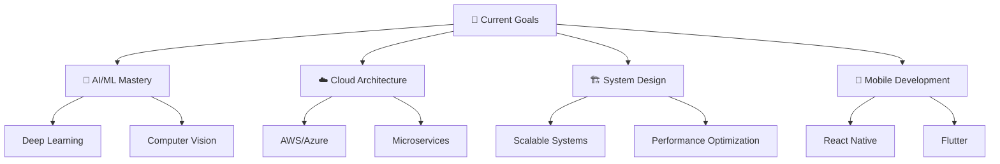

# 🚀 Shekhawat4u | Full-Stack Developer & AI Enthusiast

<div align="center">
  
</div>

<div align="center">
  
  
  
</div>

---

## 🎯 About Me

> *"Code is like humor. When you have to explain it, it's bad."* – Cory House

```javascript
const shekhawat4u = {
    name: "Shekhawat",
    location: "Pilani, India 🇮🇳",
    company: "Code Caffeine",
    website: "https://codecaffeine.in",
    role: "Full-Stack Developer & Content Creator",
    learning: ["Advanced AI/ML", "Cloud Architecture", "DevOps"],
    interests: ["Open Source", "Competitive Programming", "Tech Education"],
    funFact: "I turn coffee into code and ideas into reality! ☕→💻",
    motto: "Building tomorrow's solutions today"
};
```

---

## 🛠️ Tech Arsenal

<div align="center">

### 🚀 Languages & Frameworks


### 🧠 AI & Data Science


### 🗄️ Databases & Cloud


### 🔧 Tools & Platforms


</div>

---

## 📊 GitHub Analytics

<div align="center">
  
  
</div>

<div align="center">
  
</div>

---

## 🏆 Featured Projects

<div align="center">

### 🔬 [DeepFlow-HPC](https://github.com/shekhawat4u/DeepFlow-HPC)
**High-Performance Computing for Deep Learning**
- 🚀 Advanced ML pipeline optimization
- ⚡ GPU acceleration & parallel processing
- 📊 Performance benchmarking tools
- `Python` `CUDA` `NumPy` `Parallel Computing`

### 🏅 [Datathon AI Confluence IITG-24](https://github.com/shekhawat4u/Datathon-AI-Confluence-IITG-24)
**Competition-Winning AI Solution**
- 🏆 Datathon participation project
- 📈 Advanced data analytics & visualization
- 🤖 Machine learning model deployment
- `Python` `Jupyter` `Kaggle` `Data Science`

### 🌐 [Next.js Portfolio](https://github.com/shekhawat4u/Next-Js-Portfolio)
**Modern Developer Portfolio**
- ✨ Interactive UI/UX design
- 📱 Responsive & fast loading
- 🎨 Custom animations & transitions
- `Next.js` `TypeScript` `Tailwind CSS`

### 📱 [Code Caffeine App](https://github.com/shekhawat4u/Code-Caffeine-App)
**Educational Platform Application**
- 🎓 Learning management system
- 👥 Community features
- 📚 Interactive course content
- `TypeScript` `React` `Node.js`

### 🔧 [TaskMaster Pro Chrome Extension](https://github.com/shekhawat4u/TaskMaster-Pro-Chrome-Extension)
**Productivity Enhancement Tool**
- ⏰ Advanced task management
- 🎯 Focus & productivity tracking
- 🔔 Smart notifications
- `JavaScript` `Chrome APIs` `HTML/CSS`

</div>

---

## 🎯 Current Focus

<div align="center">



</div>

---

## 🌟 Achievements & Highlights

<div align="center">

| 🏆 Achievement | 📊 Details |
|:---:|:---:|
| 🥇 **Datathon Participant** | AI Confluence IITG-24 |
| 🚀 **Open Source Contributor** | Multiple projects & repositories |
| 💻 **Full-Stack Developer** | 3+ years experience |
| 🎥 **Content Creator** | YouTube channel with tech tutorials |
| 📚 **Code Caffeine Founder** | Educational platform |
| ⭐ **GitHub Stars** | Growing open-source community |

</div>

---

## 📈 Contribution Graph

<div align="center">
  
</div>

---

## 🎵 Spotify Playing

<div align="center">
  
</div>

---

## 🤝 Let's Connect!

<div align="center">

[](https://codecaffeine.in)
[](https://youtube.com/shekhawat4u)
[](https://instagram.com/_shekhawat4u_)
[](https://linkedin.com/in/shekhawat4u)
[](https://twitter.com/shekhawat4u)
[](mailto:contact@codecaffeine.in)

</div>

---

## 💡 Fun Facts

<div align="center">

```python
def daily_routine():
    activities = [
        "🌅 Wake up with excitement for coding",
        "☕ Fuel up with coffee (lots of it!)",
        "💻 Code, debug, repeat",
        "📚 Learn something new every day",
        "🎯 Solve real-world problems",
        "🌙 Dream in code"
    ]
    return "Living the developer life! 🚀"

print(daily_routine())
```

</div>

---

## 🎯 2024 Goals

- [ ] 🚀 Launch 5 major open-source projects
- [ ] 📚 Complete advanced AI/ML certifications
- [ ] 🌟 Reach 1K GitHub followers
- [ ] 🎥 Create 100+ educational videos
- [ ] 🏆 Win a major hackathon
- [ ] 🌐 Contribute to 10+ open-source projects

---

<div align="center">
  
</div>

<div align="center">
  
  **💖 Made with passion by [Shekhawat4u](https://github.com/shekhawat4u)**
  
  *"Code is poetry written in logic"*
  
</div>
