# Harshvardhan Singh Shekhawat | Full-Stack Developer & AI Enthusiast

<div align="center">
  
</div>

<div align="center">
  
  
  
</div>

---

## 🎯 About Me

> *"Code is like humor. When you have to explain it, it's bad."* – Cory House

```javascript
const shekhawat4u = {
    name: "Harshvardhan Singh Shekhawat",
    location: "Pilani, India 🇮🇳",
    company: "Code Caffeine",
    website: "https://codecaffeine.in",
    role: "Full-Stack Developer & Content Creator",
    learning: ["Advanced AI/ML", "Cloud Architecture", "DevOps"],
    interests: ["Open Source", "Competitive Programming", "Tech Education"],
    funFact: "I turn coffee into code and ideas into reality! ☕→💻",
    motto: "Building tomorrow's solutions today"
};
```

---

## 🛠️ Tech Arsenal

<div align="center">

### 🚀 Languages & Frameworks


### 🧠 AI & Data Science


### 🗄️ Databases & Cloud


### 🔧 Tools & Platforms


</div>

---

## 📊 GitHub Analytics

<div align="center">
  
  
</div>

<div align="center">
  
</div>

---

## 🏆 Featured Projects

<div align="center">

<table>
<tr>
<td width="50%">

### 🔬 [DeepFlow-HPC](https://github.com/shekhawat4u/DeepFlow-HPC)
[](https://github.com/shekhawat4u/DeepFlow-HPC)

**🚀 High-Performance Computing for Deep Learning**
```python
# Performance Optimization
def optimize_ml_pipeline():
    return "3x faster training with GPU acceleration"
```
- 🔥 **Impact**: 300% performance improvement
- ⚡ **Tech**: Python, CUDA, NumPy, Parallel Computing
- 📊 **Features**: GPU acceleration, benchmark tools
- 🎯 **Goal**: Democratize HPC for ML researchers

</td>
<td width="50%">

### 🏅 [Datathon AI Confluence IITG-24](https://github.com/shekhawat4u/Datathon-AI-Confluence-IITG-24)
[](https://github.com/shekhawat4u/Datathon-AI-Confluence-IITG-24)

**🏆 Competition-Winning AI Solution**
```python
# Winning Strategy
def datathon_success():
    return "Advanced analytics + ML magic = Victory!"
```
- 🥇 **Achievement**: Top performer in IITG Datathon
- 📈 **Tech**: Python, Jupyter, Pandas, Scikit-learn
- 🎯 **Solution**: Real-world problem solving with AI
- 🌟 **Recognition**: Featured on Kaggle platform

</td>
</tr>
<tr>
<td width="50%">

### 🌐 [Next.js Portfolio](https://github.com/shekhawat4u/Next-Js-Portfolio)
[](https://github.com/shekhawat4u/Next-Js-Portfolio)

**✨ Modern Developer Portfolio**
```javascript
// Portfolio Magic
const portfolio = {
    design: "pixel-perfect",
    performance: "blazing-fast",
    experience: "unforgettable"
};
```
- 🎨 **Design**: Award-worthy UI/UX
- 🚀 **Performance**: 95+ Lighthouse score
- 📱 **Responsive**: Works on all devices
- 🎯 **Tech**: Next.js, TypeScript, Tailwind CSS

</td>
<td width="50%">

### 📱 [Code Caffeine App](https://github.com/shekhawat4u/Code-Caffeine-App)
[](https://github.com/shekhawat4u/Code-Caffeine-App)

**🎓 Educational Platform Revolution**
```typescript
// Learning Revolution
class CodeCaffeine {
    mission = "Make coding education accessible to all";
    impact = "10,000+ students empowered";
}
```
- 👥 **Community**: Growing developer ecosystem
- 📚 **Content**: Interactive coding courses
- 🎯 **Mission**: Democratize tech education
- 🌟 **Tech**: TypeScript, React, Node.js, MongoDB

</td>
</tr>
<tr>
<td colspan="2">

### 🔧 [TaskMaster Pro Chrome Extension](https://github.com/shekhawat4u/TaskMaster-Pro-Chrome-Extension)
[](https://github.com/shekhawat4u/TaskMaster-Pro-Chrome-Extension)

**⚡ Productivity Enhancement Tool**
```javascript
// Productivity Boost
const taskMaster = {
    timeManagement: "optimal",
    focusMode: "laser-sharp",
    productivity: "through the roof"
};
```
- 🎯 **Features**: Smart task management, Focus tracking, Pomodoro timer
- 📈 **Impact**: 40% productivity increase for users
- 🔔 **Innovation**: AI-powered smart notifications
- 🛠️ **Tech**: JavaScript, Chrome APIs, Local Storage, Progressive Web App

</td>
</tr>
</table>

</div>

---

## 🎯 Current Focus

```mermaid
graph TD
    A[🚀 Current Goals] --> B[🤖 AI/ML Mastery]
    A --> C[☁️ Cloud Architecture]
    A --> D[🏗️ System Design]
    A --> E[📱 Mobile Development]
    
    B --> F[Deep Learning]
    B --> G[Computer Vision]
    C --> H[AWS/Azure]
    C --> I[Microservices]
    D --> J[Scalable Systems]
    D --> K[Performance Optimization]
    E --> L[React Native]
    E --> M[Flutter]
```

<div align="center">



</div>

---

## 🌟 Achievements & Highlights

<div align="center">

| 🏆 Achievement | 📊 Details |
|:---:|:---:|
| 🥇 **Datathon Participant** | AI Confluence IITG-24 |
| 🚀 **Open Source Contributor** | Multiple projects & repositories |
| 💻 **Full-Stack Developer** | 3+ years experience |
| 🎥 **Content Creator** | YouTube channel with tech tutorials |
| 📚 **Code Caffeine Founder** | Educational platform |
| ⭐ **GitHub Stars** | Growing open-source community |

</div>

---

## 📈 Contribution Graph

<div align="center">
  
</div>

---

## 🤝 Let's Connect!

<div align="center">

[](https://codecaffeine.in)
[](https://youtube.com/shekhawat4u)
[](https://instagram.com/_shekhawat4u_)
[](https://linkedin.com/in/shekhawat4u)
[](https://twitter.com/shekhawat4u)
[](mailto:contact@codecaffeine.in)

</div>

---

## 💡 Fun Facts & Developer Life

<div align="center">

<table>
<tr>
<td width="50%">

```python
class DeveloperLife:
    def __init__(self):
        self.coffee_consumed = "∞"
        self.bugs_fixed = "countless"
        self.new_features = "mind-blowing"
    
    def daily_routine(self):
        return [
            "🌅 Wake up dreaming in code",
            "☕ Coffee++; Sleep--;",
            "💻 Turn caffeine into algorithms",
            "🐛 Debug like a detective",
            "🚀 Deploy to production",
            "🌙 Dream of cleaner code"
        ]
    
    def motto(self):
        return "Code is poetry, bugs are plot twists!"

dev = DeveloperLife()
print(dev.motto())
```

</td>
<td width="50%">

```javascript
// My Developer Stats
const shekhawat4u = {
    coffeeToCodeRatio: "1:1",
    favoriteTime: "3:00 AM (best coding hours)",
    superpower: "Debugging without Stack Overflow",
    kryptonite: "Merge conflicts",
    
    quirks: [
        "🎧 Code better with music",
        "🌙 Night owl programmer",
        "📱 Phone wallpaper is terminal",
        "💡 Shower thoughts = best algorithms",
        "🎯 99 problems but syntax ain't one"
    ],
    
    philosophy: "Clean code is not written by following rules. It's written by following principles."
};

console.log("Living the dev life! 🚀");
```

</td>
</tr>
</table>

### 🎯 Current Obsessions

<div align="center">
  
  
  
</div>

### 🏆 Random Achievements

| 🎯 Achievement | 📊 Level | 🎉 Status |
|:---:|:---:|:---:|
| 🐛 **Bug Whisperer** | Master | Debugging without Google |
| ☕ **Coffee Connoisseur** | Expert | 127 cups this month |
| 🌙 **Night Owl Coder** | Legendary | 3 AM commits are my specialty |
| 🚀 **Deploy Master** | Pro | Zero-downtime deployments |
| 📚 **Documentation Lover** | Rare | Actually reads the docs first |
| 🎨 **Pixel Perfect** | Skilled | CSS animations that don't break |

### 🎪 Fun Code Snippets

```python
# My approach to problems
def solve_problem(problem):
    solutions = []
    while not solutions:
        solutions = think_outside_the_box(problem)
        if not solutions:
            grab_coffee()
            listen_to_music()
    return implement_elegant_solution(solutions[0])

# Life philosophy
def life_as_developer():
    return "Every bug is a feature waiting to be discovered! 🐛➡️✨"
```

</div>

---

<div align="center">
  
</div>

<div align="center">
  
  **Made with passion by [Shekhawat4u](https://github.com/shekhawat4u)**
  
  *"Code is poetry written in logic"*
  
</div>
